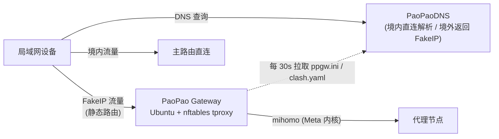

# PaoPao Gateway — cloud-init 版

基于 Ubuntu 与 cloud-init 的透明代理网关(FakeIP 网关)。本项目是 [kkkgo/PaoPaoGateWay](https://github.com/kkkgo/PaoPaoGateWay) 的衍生版本:保留原版全部运行时逻辑与功能,把底座从定制 OpenWrt ISO 替换为标准 Ubuntu Server,通过 cloud-init 一键部署到 Proxmox VE、ESXi、KVM 等虚拟化平台或裸机。

原版 ISO 形态的完整代码与构建链保留在 [`ppgw/`](ppgw/) 目录,可继续独立构建使用。

## 工作原理

局域网内只需把需要代理的设备的静态路由/默认网关指向本网关,配合支持 FakeIP 分流的 DNS(如 [PaoPaoDNS](https://github.com/kkkgo/PaoPaoDNS)),即可实现按域名透明分流:

网关开机后由 `ppgw.service` 启动主循环(`ppg.sh`):

1. **配置发现**:依次尝试 本地 `/www/ppgw.ini` → `http://paopao.dns:7889/ppgw.ini` → 网关 → DNS1 → DNS2,与原版 ISO 完全相同,因此与 PaoPaoDNS 的配置下发**无缝兼容**
2. **渲染并启动 mihomo**:FakeIP + tproxy(1082/1081)+ Web 面板(默认 80 端口),nftables 负责流量劫持,sing-box 提供可选的域名嗅探链
3. **轮询自愈**:按 `sleeptime`(默认 30s)轮询配置哈希,变更即自动重载;`fast_node` 开启时对节点测速自动选择,全挂时按策略重载或直连兜底

## 特性

- **与原版 ISO 功能完全一致**:五种运行模式(`socks5` / `ovpn` / `yaml` / `suburl` / `free`)、PPSUB 组合订阅、fast_node 测速选点、dns_burn、net_rec 流量记录、Web 面板触发重载等,运行时脚本与 `ppgw` 二进制与原版同源
- **mihomo(Meta 内核)默认内核**:构建时打包 `compatible` 与 `v3` 双版本,安装时按 CPU 微架构自动选择;geodata(geoip/geosite/ASN)一并内置
- **部署机零外部依赖**:所有二进制与数据在 GitHub Actions 内构建打包,目标机器只需下载一个 `payload.tar.gz`(支持镜像加速与局域网源,适合中国大陆网络环境)
- **标准 Ubuntu 底座**:systemd 管理、netplan 配网、apt 装依赖,可 SSH 运维,不再受定制 ISO 的硬件驱动限制

## 系统要求

- Ubuntu Server 24.04 LTS(推荐)或 22.04 LTS,amd64
- 1 GB 内存、8 GB 磁盘、1 块接入局域网的网卡(单臂部署,与原版相同)
- 平台:Proxmox VE / ESXi / KVM / VirtualBox / Hyper-V / 裸机

## 快速开始

每个 [Release](../../releases/latest) 包含三个部署所需文件:

| 文件 | 用途 |
|---|---|
| `payload.tar.gz` | 运行时载荷(ppgw、mihomo、sing-box、geodata、面板、脚本),含 sha256 校验 |
| `install.sh` | 安装脚本(装依赖、装载荷、配置系统) |
| `user-data.yaml` | cloud-init 模板 |

选择你的平台,按文档操作:

- **[Proxmox VE](docs/proxmox.md)** — cloud image + `cicustom` snippet
- **[ESXi / 通用虚拟化](docs/esxi.md)** — cloud image + NoCloud seed ISO
- **[裸机](docs/baremetal.md)** — 装好 Ubuntu Server 后一条命令安装

部署要点:

1. 修改 `user-data.yaml`:配置登录方式;若局域网已有 PaoPaoDNS,**删除** `write_files` 段(自动发现配置),否则内联你的 `/www/ppgw.ini`
2. 首次开机自动安装并重启一次(应用 `eth0` 网卡命名),之后 `ppgw.service` 常驻
3. 浏览器访问 `http://<网关IP>/ui` 打开管理面板(密码为 `clash_web_password`)
4. 把客户端设备的网关/静态路由指向本机 IP

配合 PaoPaoDNS 使用时,建议其容器环境设置 `CUSTOM_FORWARD=<网关IP>:53`,并在 `ppgw.ini` 中设置 `dns_ip=<PaoPaoDNS IP>`、`dns_port=5304`。

## 配置参考(ppgw.ini)

所有参数与原版一致,完整说明见[原版文档](ppgw/ReadMe.md#ppgwini配置说明)。常用参数:

| 参数 | 默认值 | 说明 |
|---|---|---|
| `mode` | `free` | 运行模式:`socks5` / `ovpn` / `yaml` / `suburl` / `free` |
| `fake_cidr` | `7.0.0.0/8` | FakeIP 网段,需与 DNS 侧一致(PaoPaoDNS 常用 `198.18.0.0/16`) |
| `dns_ip` / `dns_port` | `1.0.0.1` / `53` | 可信 DNS;配合 PaoPaoDNS 可设 `5304` 端口 |
| `clash_web_port` / `clash_web_password` | `80` / `clashpass` | Web 面板端口与密码 |
| `openport` | `no` | 是否向局域网开放 1080 mixed 代理端口(`openport_auth` 启用 1088 认证端口) |
| `udp_enable` | `no` | 是否放行 UDP 流量(节点 UDP 不稳定时不建议开启) |
| `sleeptime` | `30` | 配置轮询间隔(秒) |
| `yamlfile` | `custom.yaml` | `yaml` 模式:与 ppgw.ini 同源下发的配置文件名 |
| `suburl` / `subtime` / `subcron` | — | `suburl` 模式:订阅地址 / 刷新间隔 / 每日定时刷新(0-23 时) |
| `fast_node` | `no` | `yes`/`check`/`no`:节点测速与自动选择策略 |
| `test_node_url` | `https://www.youtube.com/generate_204` | 可达性/测速地址 |
| `fall_direct` | `no` | 全部节点失败时是否回退直连 |
| `dns_burn` / `ex_dns` | `no` / `223.5.5.5:53` | 节点域名多路解析硬编码(依赖 `fast_node=yes`) |
| `net_rec` / `max_rec` | `no` / `5000` | 流量记录功能与最大记录数 |

PPSUB 组合订阅(`suburl="ppsub@..."`)同样完全支持,见[原版 PPSUB 指南](ppgw/ReadMe.md#ppsub-组合订阅使用指南)。

## 与原版 ISO 的差异

| | 原版 ISO | cloud-init 版 |
|---|---|---|
| 底座 | 定制 OpenWrt(ISO 光盘启动) | Ubuntu Server 24.04(标准安装) |
| 进程管理 | rc.local + procd | systemd(`ppgw.service`) |
| 网络配置 | uci `/etc/config/network` | netplan(`/etc/netplan/99-ppgw.yaml`) |
| 配置注入 | Docker 定制 ISO / DHCP 发现 | cloud-init user-data / DHCP 发现 |
| 运行时逻辑 | `ppg.sh` + `ppgw` + mihomo | **同源照搬,功能一致** |

运行时脚本仅做了三处机械替换:bash 解释器、`ps ax`、`busybox ntpd`,与 PaoPaoDNS 的对接协议、配置格式、Web 面板、API 行为均与原版一致,可直接替换存量 ISO 网关。

## FAQ

**Q: 中国大陆网络下载失败?**
`install.sh` 会按 局域网源(`PPGW_BASE_URL`)→ gh-proxy 镜像 → GitHub 直连 的顺序尝试,均带 sha256 校验。最稳妥的方式是把 Release 的三个文件放到局域网 HTTP 服务上,在 user-data 中设置 `PPGW_BASE_URL`。

**Q: 为什么要重启一次?网卡名是怎么处理的?**
运行时脚本沿用原版的 `eth0` 硬编码。安装时写入内核参数 `net.ifnames=0`,重启后首块网卡固定命名为 `eth0`,对 PVE/ESXi/裸机通用。

**Q: 53 端口被 systemd-resolved 占用?**
安装时已通过 `DNSStubListener=no` 释放 53 端口,并把 `/etc/resolv.conf` 指向 DHCP 下发的真实上游 DNS(脚本的 `paopao.dns` 发现依赖它)。

**Q: 如何启用 IPv6?**
默认与原版一致仅 IPv4。需要 IPv6 时:删除 `/etc/sysctl.d/99-ppgw.conf` 中的两行 `disable_ipv6`,在 `/etc/config/network` 中加入 `eth06` 段(格式见原版文档),并在 netplan 中启用 `dhcp6`,然后重启。

**Q: 如何升级?**
重新运行 `install.sh` 即可拉取最新 payload 覆盖安装,`/www/` 下的本地配置不受影响。

**Q: 面板打不开 / 节点全部超时?**
先看控制台或 `journalctl -u ppgw -f` 的日志;确认 `ppgw.ini` 是否被正确获取(日志会打印五级发现的尝试过程)、`dns_ip` 是否可达、订阅是否可用。

## License 与致谢

本项目为 [kkkgo/PaoPaoGateWay](https://github.com/kkkgo/PaoPaoGateWay) 的衍生作品,遵循 [GPL-3.0](LICENSE) 许可发布,感谢原作者的出色工作。同时感谢以下项目:

- [mihomo](https://github.com/MetaCubeX/mihomo)(MetaCubeX)— 默认代理内核
- [sing-box](https://github.com/SagerNet/sing-box) 及 [kkkgo/box](https://github.com/kkkgo/box) — 域名嗅探链
- [meta-rules-dat](https://github.com/MetaCubeX/meta-rules-dat) — geodata 数据
- [PaoPaoDNS](https://github.com/kkkgo/PaoPaoDNS) — 推荐搭配的分流 DNS
