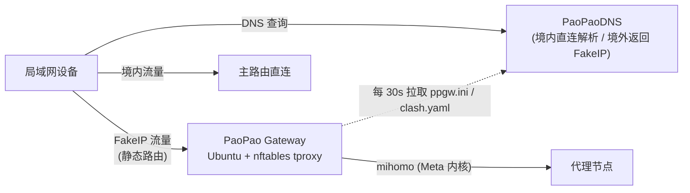

# 参考:架构、配置与 FAQ

## 工作原理

局域网内把需要代理的设备的静态路由/默认网关指向本网关,配合支持 FakeIP 分流的 DNS(如 [PaoPaoDNS](https://github.com/kkkgo/PaoPaoDNS)),即可按域名透明分流:

网关开机后由 `ppgw.service` 启动主循环(`ppg.sh`),与原版 ISO 完全相同:

1. **配置发现**:依次尝试 本地 `/www/ppgw.ini` → `http://paopao.dns:7889/ppgw.ini` → 网关 → DNS1 → DNS2,与 PaoPaoDNS 的配置下发无缝兼容
2. **渲染并启动 mihomo**:FakeIP + tproxy(1082/1081)+ Web 面板(默认 80 端口),nftables 负责流量劫持,sing-box 提供可选的域名嗅探链
3. **轮询自愈**:按 `sleeptime`(默认 30s)轮询配置哈希,变更即自动重载;`fast_node` 开启时对节点测速自动选择,全挂时按策略重载或直连兜底

配合 PaoPaoDNS 使用时,建议其容器环境设置 `CUSTOM_FORWARD=<网关IP>:53`,并在 `ppgw.ini` 中设置 `dns_ip=<PaoPaoDNS IP>`、`dns_port=5304`。

## ppgw.ini 配置参考

所有参数与原版一致,完整说明见[原版文档](../ppgw/ReadMe.md#ppgwini配置说明)。常用参数:

| 参数 | 默认值 | 说明 |
|---|---|---|
| `mode` | `free` | 运行模式:`socks5` / `ovpn` / `yaml` / `suburl` / `free` |
| `fake_cidr` | `7.0.0.0/8` | FakeIP 网段,需与 DNS 侧一致(PaoPaoDNS 常用 `198.18.0.0/16`) |
| `dns_ip` / `dns_port` | `1.0.0.1` / `53` | 可信 DNS;配合 PaoPaoDNS 可设 `5304` 端口 |
| `clash_web_port` / `clash_web_password` | `80` / `clashpass` | Web 面板端口与密码 |
| `openport` | `no` | 是否向局域网开放 1080 mixed 代理端口(`openport_auth` 启用 1088 认证端口) |
| `udp_enable` | `no` | 是否放行 UDP 流量(节点 UDP 不稳定时不建议开启) |
| `sleeptime` | `30` | 配置轮询间隔(秒) |
| `yamlfile` | `custom.yaml` | `yaml` 模式:与 ppgw.ini 同源下发的配置文件名 |
| `suburl` / `subtime` / `subcron` | — | `suburl` 模式:订阅地址 / 刷新间隔 / 每日定时刷新(0-23 时) |
| `fast_node` | `no` | `yes`/`check`/`no`:节点测速与自动选择策略 |
| `test_node_url` | `https://www.youtube.com/generate_204` | 可达性/测速地址 |
| `fall_direct` | `no` | 全部节点失败时是否回退直连 |
| `dns_burn` / `ex_dns` | `no` / `223.5.5.5:53` | 节点域名多路解析硬编码(依赖 `fast_node=yes`) |
| `net_rec` / `max_rec` | `no` / `5000` | 流量记录功能与最大记录数 |

PPSUB 组合订阅(`suburl="ppsub@..."`)同样完全支持,见[原版 PPSUB 指南](../ppgw/ReadMe.md#ppsub-组合订阅使用指南)。

## 软件包与系统改动

| 包 | 内容 |
|---|---|
| `ppgw-core` | `ppgw`、mihomo(装机按 CPU 微架构选 v3/compatible)、sing-box、运行时脚本、`ppgw.service`、clash 基础模板 |
| `ppgw-geodata` | geoip.metadb / GeoSite.dat / GeoIP.dat / ASN.mmdb(装到 `/etc/config/clash/`) |
| `ppgw-dashboard` | Web 面板静态文件 |
| `ppgw-system` | 系统集成:netplan(全网口 DHCP)、sysctl 转发参数、resolved 关闭 53 端口 stub、chrony 国内 NTP 源、启用 `ppgw.service` |
| `ppgw-config` | 仅 seed ISO:登录 / 静态网络 / `/www/ppgw.ini`,由 `make-seed.sh` 从 `ppgw.conf` 生成 |

安装 `ppgw-system` 会对主机做以下改动(appliance 化,不适合与其他服务混跑):

- 接管 netplan:删除 cloud-init 生成的网络配置,所有 `e*` 网口 DHCP,运行时使用持有默认路由的网口
- `systemd-resolved` 设置 `DNSStubListener=no` 释放 53 端口,`/etc/resolv.conf` 软链到 DHCP 下发的真实上游 DNS
- 开启 `ip_forward` 等 sysctl,默认关闭 IPv6
- chrony 替代 systemd-timesyncd,并追加国内可达的 NTP 源(含 IP 直连源)

## 与原版 ISO 的差异

| | 原版 ISO | cloud-init 版 |
|---|---|---|
| 底座 | 定制 OpenWrt(ISO 光盘启动) | Ubuntu Server 24.04(标准 cloud image) |
| 进程管理 | rc.local + procd | systemd(`ppgw.service`) |
| 网络配置 | uci `/etc/config/network` | netplan,全网口 DHCP + 默认路由动态探测 |
| 软件分发 | Docker 重制 ISO | deb 包(离线 seed ISO / tar) |
| 配置注入 | Docker 定制 ISO / DHCP 发现 | `ppgw.conf` → ppgw-config deb / DHCP 发现 |
| 运行时逻辑 | `ppg.sh` + `ppgw` + mihomo | **同源照搬,功能一致** |

运行时脚本相对原版仅做机械替换:bash 解释器、`ps ax`、时间同步交给 chrony 常驻管理(原版每次开机 busybox ntpd 单次对时)、日志走 systemd journal(原版写 `/dev/tty0`)、网卡由默认路由动态探测(原版硬编码 `eth0`)、IPv6 开关改为 `/etc/ppgw/ipv6_enabled` 标志文件(原版读 uci 网络配置)。与 PaoPaoDNS 的对接协议、配置格式、Web 面板、API 行为均与原版一致,可直接替换存量 ISO 网关。

## FAQ

**Q: 部署时需要访问 GitHub 吗?**
不需要。所有二进制、geo 数据、依赖 deb 都在 CI 构建时打进 `ppgw-seed.iso` / `ppgw-offline.tar.gz`,部署机全程零外网。只有下载 Release 产物这一步需要网络,可在任何有网的机器上完成后 scp/上传。

**Q: 网卡是怎么处理的?多网口机器插哪个口?**
netplan 对所有 `e*` 网口开启 DHCP,运行时自动使用持有默认路由的网口,不依赖网卡命名,插任意口即可。安装后的重启是为了让 netplan/sysctl/服务以干净状态生效。

**Q: 53 端口被 systemd-resolved 占用?**
安装时已通过 `DNSStubListener=no` 释放 53 端口,并把 `/etc/resolv.conf` 指向 DHCP 下发的真实上游 DNS(脚本的 `paopao.dns` 发现依赖它)。

**Q: 如何启用 IPv6?**
默认与原版一致仅 IPv4。需要 IPv6 时:删除 `/etc/sysctl.d/99-ppgw.conf` 中的两行 `disable_ipv6`,创建标志文件 `touch /etc/ppgw/ipv6_enabled`,并在 `/etc/netplan/99-ppgw.yaml` 中启用 `dhcp6: true`,然后重启。

**Q: 如何升级?**
VM:挂上新版 `ppgw-seed.iso` 重启即可(共享包版本更新会自动安装);或在线 `apt-get install ./debs/*.deb`。裸机:解开新版 offline 包重跑 `install.sh`。`/www/` 下的本地配置均不受影响。

**Q: 面板打不开 / 节点全部超时?**
先看控制台或 `journalctl -u ppgw -f` 的日志;确认 `ppgw.ini` 是否被正确获取(日志会打印五级发现的尝试过程)、`dns_ip` 是否可达、订阅是否可用。

**Q: 修改了 ppgw.conf 但没有生效?**
确认是用 `make-seed.sh` 重打包的(它会刷新 instance-id 并递增配置包版本),手工 xorriso 封盘不会触发重新配置。
